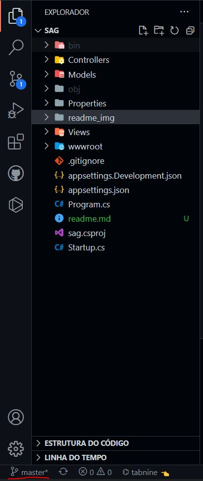
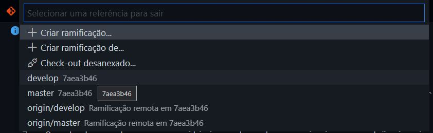

# Sistema Administrativo Gastronômico

## Instruções de git

A branch que deve ser usada para desenvolvimento é a `develop`, a `master` não deve ser usada nem ser feito commit nela.

Quando der o clone no repositório, a branch que vai vir por padrão é a `master`, pra trocar para a `develop`, na raiz do projeto, rode o comando no terminal:
```
git checkout develop
```

Também é possível alterar no Visual Studio Code, fazendo da seguinte forma:

No canto esquerdo inferior, clique no botão que estará escrito `master`



Depois selecione a branch `develop` na janelinha que vai abrir:



>Atenção: antes de ser feito o commit, precisa verificar se oque foi desenvolvido não "`quebrou`" o sistema.

>Atenção 2: fazer o commit pelo Visual Studio Code.

## Comandos .NET

Para `buildar` as mudanças:
```
dotnet build
```

Para rodar o Sistema, na raiz do projeto:
```
dotnet run
```

Para rodar o Sistema e não precisar ficar rodando o comando anterior, com build automático em cada mudança e salvamento:
```
dotnet watch run
```


## URL's úteis e cursos

Artigo sobre as bibliotecas JS para criação de gráficos:
```
https://marquesfernandes.com/desenvolvimento/6-bibliotecas-javascript-para-criacao-de-graficos/
```

Documentação Bootstrap:
```
https://getbootstrap.com.br/docs/4.1/getting-started/introduction/
```

Curso `Discover` da Rocketseat, com curso sobre os protocolos Http, curso de HTML, git, CSS e JavaScript. É só criar uma conta e começar.
```
https://www.rocketseat.com.br/discover
```

Google Fonts:
```
https://fonts.google.com/
```

Font Awesome para ícones:
```
https://fontawesome.com/v5.15/icons?d=gallery&p=2
```
